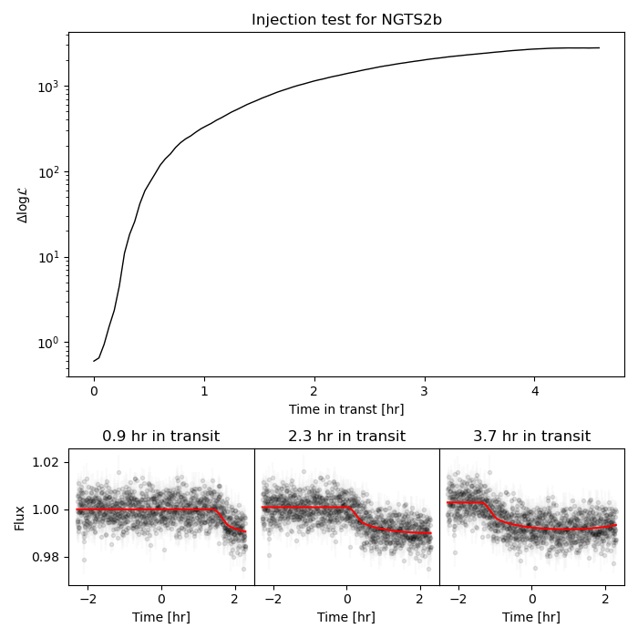
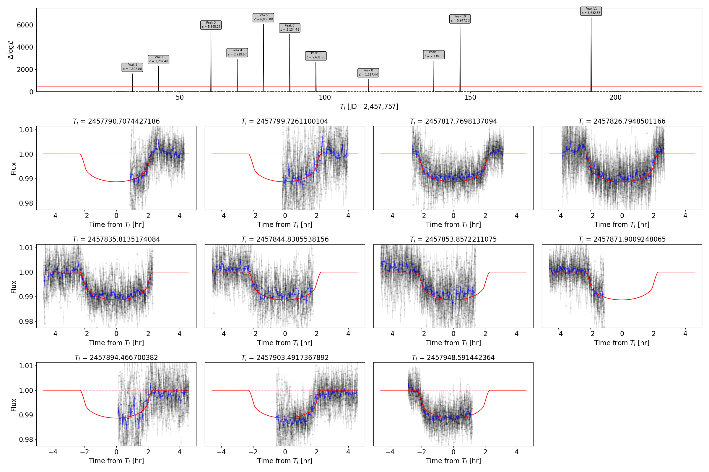

# Summary

hey

# Statement of need

Archival photometry provides means to "pre-cover" either the orbital period or a discrete set of possible aliases. Recent work by  used a box-fitting least squared algorithm with fixed depth, width, and ingress/egress duration with injected transits in Kilodegree Extremely Little Telescope data to efficiently recover the orbital periods of up to 1 year for planets larger than Saturn. other work by  employed a bespoke template matching algorithm in using archival photometry from the Wide Angle Search for Planets to constrain the orbital period to a discrete set of 3 possible aliases for the \tess\ single transit candidate TIC-238855958. The basis of this algorithm continues to be used as part of an semi-automated algorithm to detect transit events for \ngts\ observations of \tess\ single transit candidates that are being  monitored. There are subtleties to this algorithm that were not explicitly discussed by  or  such as optimal step sizes and injection tests to determine a suitable threshold. The aim of this work is to formalise this algorithm and apply it to various test cases and active single transit candidates. 

# Mathematics

The template matching algorithm described by estimates the difference in log-likelihood of a transit model over a null model. Given a series of $n$ observations described time, $t_n$, flux, $F_{n}$, and flux errors, $\sigma_{n}$ we calculate the chi-squared for the null model,

\begin{equation}
    \chi^2_{\rm null} = \sum_{n} \frac{(F_{n} - w)^2}{\sigma_n^2},
\end{equation}

where $w$ is the weighted mean of the dataset, 
\begin{equation}
w = \frac{\sum\limits_{n} F_n \sigma_n}{\sum\limits_{n} \sigma_n}.
\end{equation}

The log-likliehood of the null model is $\log \mathcal{L}_{\rm null} = -\chi^2_{\rm null} / 2$ and yields a quantity which can be compared to a that of a more complex transit model template, $m$. In this work we use the methods described in to solve Kepler's equations for the projected planet-star separation and the analytical approximation presented by [@2019A&A...622A..33M] to describe an object eclipsing a star with limb-darkening described by the power-2 law. Obtaining $m$ requires fitting an observed transit event with a fixed orbital period, $P_{s}$, to find the scaled orbital separation, $R_1 / a$, ratio of radii, $k = R_2/R_1$, and impact parameter,$b$. The limb-darkening parameters associated with the power-2 law $c$ and $\alpha$ can either be modelled directly or interpolated using the spectroscopic atmospheric parameters of the host star. 

Once the transit model template is established we create a series of epochs, $T_{i}$, for which the transit model will be centred and compared to the data. The extent of $T_{i}$ must be chosen such that any value of $t_n$ must be enclosed by a values of $T_{i}$ that extend to at least half the transit width, $W$, where,
%
\begin{equation}
    W = \frac{P_{s}}{\pi} \times \arcsin \left(  \frac{R_1}{a} \times \sqrt{\frac{(1+k^2) - b^2}{1 - b^2\left( \frac{R_1}{a}^2 \right)} }  \right).
\end{equation}
%
The step size of $T_{i}$ must be chosen to sufficiently and precisely recover transit events and is a function of $W$ and geometry. Typically, we find that $T_{i+1} - T_{i} = W/30$ is sufficient to recover epochs to a reasonable precision, although this may not be optimal for all transit shapes. For each epoch in $T_{i}$ we calculate,

\begin{equation}
    \chi^2_{\rm transit, i} = \sum_{n} \frac{(F_{n} - m_n(T_{i}))^2}{\sigma_n^2},
\end{equation}
%
and corresponding values of $\log \mathcal{L}_{\rm transit,i} = -\chi^2_{\rm transit, i} / 2$. In these tests, we set $w=1.$ when calculating $\chi^2_{\rm null}$. Epochs of $T_{i}$ where $\Delta \log \mathcal{L} = \log \mathcal{L}_{\rm transit,i} - \log \mathcal{L}_{\rm null}$ exceed 0 are where the transit model is well-matched to the data. In real datasets, some peaks are artefacts of white and red-noise and require sufficient thresholds for $\Delta \log \mathcal{L}$ to minimise false-positive detections of transit events. This can be achieved by estimating the typical noise profile of the dataset and creating a synthetic time series, $T_j$, between $-W/2$ and $W/2$ at the same cadence of the data. We inject the transit model at trial epochs, $T_{j}$, spanning 0 to $W$ and we can obtain the maximum value of $\Delta \log \mathcal{L}$ as a function of the span of data in transit. This is exemplified in Figure \autoref{fig:Figure1} with the \ngts\ data of the inflated hot-Jupiter NGTS-2b. Figure \ref{fig:Figure1} shows that $\Delta \log \mathcal{L}$ is not sensitive to transit detection when less than $\sim$30-minutes of data are present for a given epoch. This is expected as the equivalent drop in the transit model after the first 30 minutes of ingress is is approximately equal to the scatter of the raw data and so a null model cannot be excluded. 

We decided to search for transit events of NGTS-2b in \ngts\ data using a threshold of $\Delta \log \mathcal{L} > 100$ which is equivalent to at least 30 minutes of in-transit data (Figure \autoref{fig:Figure_2}). In all, we recover 11 transit events with the smallest value of $\Delta \log \mathcal{L} = 1117$. Using the best-fitting orbital solution there is an additional epoch which contains the last 15 minutes of egress. This did correspond to a peak of $\Delta \log \mathcal{L} = 20$ but is consistent with other peaks arising from red-noise and systematic offsets.

# Acknowledgements

SG has been supported by STFC through consolidated grants ST/L000733/1 and ST/P000495/1

# References